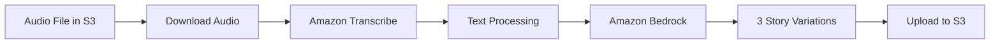

# 🖋️ Fermin Writer - AWS Edition

> *"Every book, every volume you see here, has a soul. The soul of the person who wrote it and of those who read and lived and dreamed with it."* - Carlos Ruiz Zafón

A gothic story generator that transforms audio recordings into haunting narratives in the style of Fermín Romero de Torres from "The Shadow of the Wind". Using the power of AWS AI services, this application creates atmospheric tales that capture the essence of Barcelona's literary mysteries.

## ✨ Features

- 🎵 **Audio Processing**: Supports multiple audio formats (M4A, MP3, WAV)
- 📝 **AI Transcription**: High-accuracy speech-to-text conversion
- 🏰 **Gothic Story Generation**: Creates 3 unique story variations in Fermín's distinctive style
- ☁️ **Cloud-Native**: Fully integrated with AWS services
- 📚 **Automated Workflow**: End-to-end processing from audio to published stories

## 🛠️ AWS Services Used

| Service | Purpose | Features Used |
|---------|---------|---------------|
| **Amazon S3** | Storage for audio files and generated stories | Object storage, versioning |
| **Amazon Transcribe** | Audio-to-text transcription | Real-time transcription, punctuation |
| **Amazon Bedrock** | AI-powered story generation | Amazon Nova model, prompt engineering |

## 📋 Prerequisites

- Python 3.8 or higher
- Audio file in supported format (M4A, MP3, WAV)

## 🚀 Quick Start

### Clone and Install
```bash
git clone <repository-url>
cd Fermin-writer
pip install -r requirements.txt
```

## ⚙️ Configuration

### Supported Audio Formats
- M4A (recommended)
- MP3
- WAV
- FLAC

## 🔄 How It Works



1. **📥 Download**: Fetches audio file from your S3 bucket
2. **🎤 Transcribe**: Amazon Transcribe converts speech to text with punctuation
3. **🤖 Generate**: Amazon Bedrock creates 3 gothic story variations using the Nova model
4. **📤 Upload**: Stories are saved back to S3 with organized naming
5. **✅ Complete**: Ready-to-read gothic tales in Fermín's style

## 📖 Output

Generated stories are automatically uploaded to S3 with organized structure:

```
s3://your-bucket/
└── fermin-audio/
    └── history/
        ├── {audio_name}_story_1.txt
        ├── {audio_name}_story_2.txt
        └── {audio_name}_story_3.txt
```

### Story Characteristics
- **Length**: 500-800 words per story
- **Style**: Gothic atmosphere with Barcelona setting
- **Tone**: Mysterious, melancholic, literary
- **Character**: Written from Fermín's perspective

## 🔐 AWS Permissions

### Required IAM Permissions

#### For S3 Operations
```json
{
    "Version": "2012-10-17",
    "Statement": [
        {
            "Effect": "Allow",
            "Action": [
                "s3:GetObject",
                "s3:PutObject",
                "s3:ListBucket"
            ],
            "Resource": [
                "arn:aws:s3:::your-fermin-bucket",
                "arn:aws:s3:::your-fermin-bucket/*"
            ]
        }
    ]
}
```

#### For Transcribe and Bedrock
```json
{
    "Version": "2012-10-17",
    "Statement": [
        {
            "Effect": "Allow",
            "Action": [
                "transcribe:StartTranscriptionJob",
                "transcribe:GetTranscriptionJob",
                "transcribe:ListTranscriptionJobs",
                "bedrock:InvokeModel"
            ],
            "Resource": "*"
        }
    ]
}
```

## 🐛 Troubleshooting

### Common Issues

| Issue | Solution |
|-------|----------|
| **Audio file not found** | Verify S3 path and bucket permissions |
| **Transcription fails** | Check audio format and file size (<2GB) |
| **Bedrock access denied** | Ensure model access is enabled in AWS Console |
| **Stories not uploading** | Verify S3 write permissions |

## 🤝 Contributing

1. Fork the repository
2. Create a feature branch
3. Make your changes
4. Add tests if applicable
5. Submit a pull request

## 📄 License

This project is licensed under the MIT License - see the LICENSE file for details.

## 🙏 Acknowledgments

- Inspired by Carlos Ruiz Zafón's "The Shadow of the Wind"
- Powered by AWS AI services
- Hazlo con el tipo de ❤️ que deja huellas en el alma